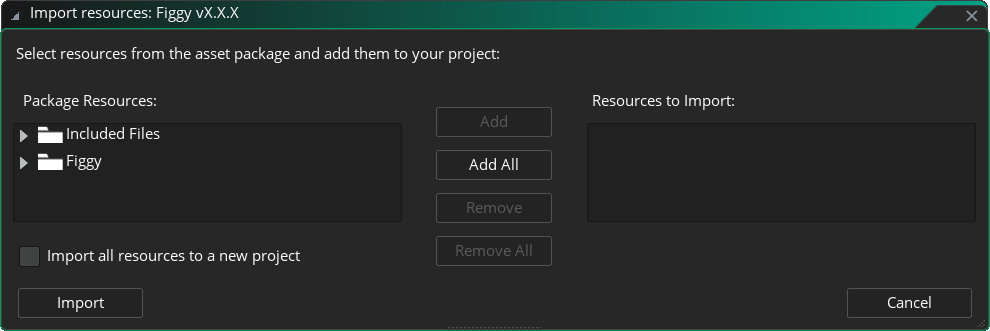
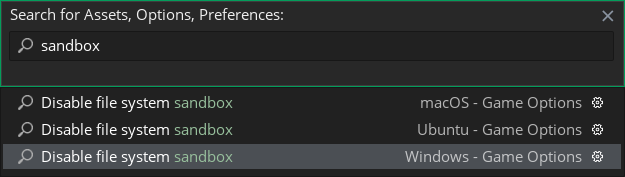
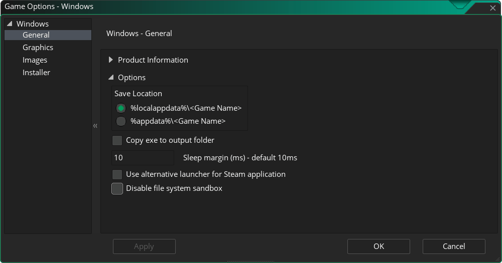
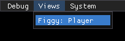
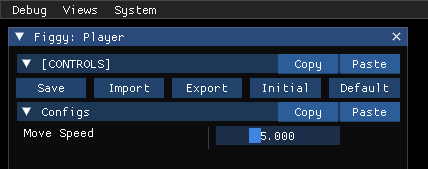

# Getting Started

## Welcome!

Welcome to Figgy! Let's get you set up and ready to create your first configs!

We'll start by importing the `.yymps` package and preparing your project in [Installation](#installation). Then, in [Usage](#usage), we'll walk through defining your first config layout and exploring how Figgy converts your widgets into a usable config struct. By the end, you'll have a simple working example that lets you define configs, access them easily in your objects, and edit them live using the Figgy :Interface:.

:::tip
Throughout this page, and the documentation as a whole, you'll see many hyperlinks to key Figgy concepts. I encourage you to explore them briefly as you get started, as they'll help you quickly understand the library's overall structure.
:::

## Requirements

* [GameMaker](https://gamemaker.io/en/download) version `IDE v2024.14.0.207` and `Runtime v2024.14.0.251` or above.
* Basic familiarity with GameMaker and GML, including:
    * Asset types (rooms, objects, scripts, sprites, tilemaps, etc).
    * Working with objects and events.
    * Structs, functions/methods, macros.

## Installation

### 1. Download

Download the `Figgy v1.0.0.yymps` package from the latest [Release](https://github.com/glebtsereteli/Figgy/releases/v1.0.0).

### 2. Import

Import the package into your project.
* Navigate to __Tools__ in the top toolbar and click __Import Local Package__, or just drag and drop the file into GameMaker.
<!--  -->
* Locate and select the `Figgy v1.0.0.yymps` local package in Explorer/Finder.
* Click **Add All**, then **Import**.

> The whole library lives inside the `Figgy` folder, and the only file under `Included Files` is the [MIT license](/pages/home/faq/#📍-how-is-figgy-licensed-can-i-use-it-in-commercial-projects).

### 3. Disable Sandboxing

Disabling sandboxing is required for Figgy to save changes inside your project's datafiles (for :Persistence:), and to enable :Input/Output:.
* Press **Ctrl+T** to bring up the search bar, look for **"sandbox"**, and select your target platform.

* At the very bottom of the **General/Options** section, enable the **Disable file system sandbox** option, click **Apply**, and close the window.


---

And you're good to go! Continue to the [Usage](#usage) section below to set up your first configs.

:::tip
If you already have Figgy installed and want to update to the latest version, check the [Updating](/pages/home/faq#📍-how-do-i-update-to-the-latest-version-of-figgy) :FAQ: entry for instructions.
:::

## Usage

### 1. Setting Up

Before you can use Figgy in your game, you need to define your configuration layout inside the global FiggySetup() function.

:Setup: is Figgy's central hub and entry point. It's where you create your :Scope Widgets:, :Value Widgets:, and :Decor Widgets: - everything that appears in the :Interface: and becomes part of your config data struct.

In this simple example, we create a `Player` :Window: :Scope Widget:, which adds a new struct to the root scope of the config. Inside it, we define a single `Move Speed` :Float: :Value Widget: with a default value of `5`, and a range from `1` to `15`.

:::code-group
```js [Setup]
function FiggySetup() {
    Figgy.Window("Player");
        Figgy.Float("Move Speed", 5, 1, 15);
}
```
:::

### 2. Understanding Data

Now let's see how this setup is represented in the config struct that you'll be accessing throughout your game:
:::code-group
```js [Config Struct]
{
    Player: {
        MoveSpeed: 5,
    },
}
```
:::

You'll notice that our variable name `"Move Speed"` turned into `MoveSpeed` in the config. By default, Figgy removes spaces from variable names so you can access them easily without using the struct accessor with string keys, while keeping the interface label more readable.

### 3. Accessing Values

Now that our configs are defined in :Setup: and we understand how they appear in the config struct, let's actually use the `MoveSpeed` value in our player object.

You can access the current config struct with :.GetCurrent():, which works fine for small setups, but becomes tedious once your config grows into hundreds of values. Here's the access pattern I recommend for comfortable work at scale.

---

* Start by creating a global + macro pair for clean root access. Since the config struct reference never changes, you can store it in a global variable once and simply reuse it throughout the game.

    Do this wherever you handle your game's initialization, **after** scripts are initialized, and **before** you access any configs. Usually that happens in some master object's Create event, or the first room's Creation Code:
    :::code-group
    ```js [Game Startup]
    #macro CFG global.__config
    CFG = Figgy.GetCurrent();
    ```
    :::
* Then, in your player object's Create event, store a reference to the `Player` config so you can easily access its values throughout the object:
:::code-group
```js [objPlayer's Create event]
cfg = CFG.Player;
```
:::
* With all that set up, we can now use our config in `objPlayer`'s movement code. For example, here's how you could use `MoveSpeed` for simple top-down movement and collision:
:::code-group
```js [objPlayer's Step event]
var _xInput = keyboard_check(ord("D")) - keyboard_check(ord("A"));
var _yInput = keyboard_check(ord("S")) - keyboard_check(ord("W"));
if ((_xInput != 0) or (_yInput != 0)) {
    var _dir = point_direction(0, 0, _xInput, _yInput);
    var _xSpd = lengthdir_x(cfg.MoveSpeed, _dir); // [!code focus]
    var _ySpd = lengthdir_y(cfg.MoveSpeed, _dir); // [!code focus]
    move_and_collide(_xSpd, _ySpd, objWall);
}
```
:::

Now, this is all great so far, but where can we actually edit the config live while the game is running to see our changes reflected in the player movement?

### 4. Editing Configs Live

If at least one of the :Windows: you defined in :Setup: is marked as `visible`, Figgy will automatically open the :Interface: for you.

Otherwise, you can open it manually with `show_debug_overlay(true, true);`, or use this little trick to open the overlay without the FPS window:
```js
var _dummy = dbg_view("dummy", false);
dbg_view_delete(_dummy);
```

Once the overlay is open, go to the **Views** menu in the top bar. Under **Views**, select the **Figgy: Player** window created by our :Window: :Scope Widget: to access your player configs.



There, you'll see 3 things:
* The [Controls Section](/pages/home/interface/interface/#controls-section) that offers root-level controls over your configs and is created in all :Windows: by default.
* The automatic `Configs` section that is created inside :Windows: if no :Sections: were used at the start.
* The `Move Speed` :DBG Slider: created by our :Float: :Value Widget:, which we can now adjust to change the player's movement speed in real time.



## That's it!

You've now seen how to get Figgy up and running in your GameMaker project - from installing the library, defining your first configs in :Setup: and understanding how they appear in the config struct, to accessing and using them in your objects.

By creating a global reference to your config and linking object-level shortcuts, you can comfortably scale Figgy to handle large and complex setups. And with the automatically built :Interface:, you can tweak values live, instantly seeing the effects in your game.

## What's Next?

Next up, check out:
* The :Interface: page to learn how Figgy builds its interface and how it operates.
* The :Persistence: page to learn about Figgy's saving and loading operations.
* The :Demos: page to explore the available demos.
* The :Figgy: section for an overview of the syntax and the key parts of the API.

:::tip
I recommend starting with the :Setup: section that covers :Scope Widgets:, :Value Widgets:, :Decor Widgets:, :OnChange: callbacks, and formatting tips & best practices. This is where you'll be spending most of your time when working with Figgy.
:::