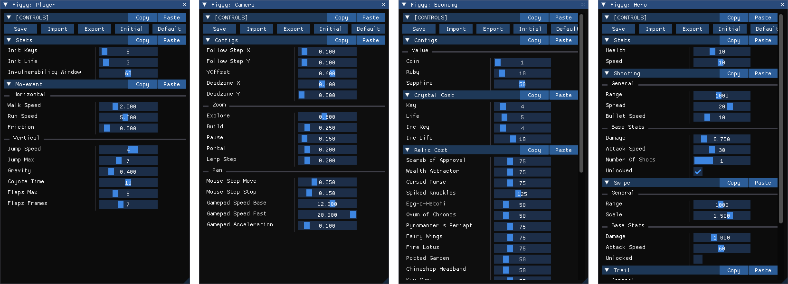

# Interface

## Overview

Figgy's interface lets you edit your configs live while the game is running, and see those changes reflected instantly across every part of your gameplay that's connected to Figgy.

The entire interface is generated automatically from your :Setup: using three types of widgets. :Scope Widgets: shape the struct-based hierarchy of your config, :Value Widgets: define the editable values used throughout your code (like `Health` and `MoveSpeed`), and :Decor Widgets: add extra visual structure and utility to the UI.

The system is built on top of GameMaker's cross-platform :Debug Overlay:, so all Figgy views appear in the same debug hub as any other views you use (like [Lookout](https://github.com/glebtsereteli/Lookout)).

Figgy also includes a dedicated :Controls Section: that lets you manage the overall state of the entire config struct. See more info about it below.

## Controls Section

The Controls Section provides global, root-level controls that affect the entire config struct, regardless of which window you're using it from. These controls let you [Save](#saving), [Import and Export](#inputoutput), and [Reset](#resetting) your configs.

### Saving

**Save** saves the current config into your project's datafiles. See the :Persistence: section to learn more about saving and loading.

::: info NOTE
The **Save** button appears only when running the game from the IDE, since in exported builds Figgy is intended only for reading configs, not modifying them and saving changes.
:::

### Input/Output
* **Import** loads a config from an external file. The button opens a file selection dialog so you can pick a compatible config file to import. This is helpful for sharing setups between team members and reviewing different balancing passes. See :.Import(): for more info.
* **Export** saves the current config to an external file. The button opens a save dialog so you can choose where to write the file. This is useful for backing up configs or sharing your current tuning with others. See :.Export(): for more info.

### Resetting
* **Initial** resets the current config to its Initial state. This state is captured after default values are initialized in :Setup: and saved changes are loaded. Use it to return the config to how it was when the game first started, ideal for starting fresh after experimenting. See :.ResetToInitial(): for more info.
* **Default** resets the current config to its Default state. This state is captured after default values are initialized in :Setup:, before saved changes are loaded. Use it to fully revert to the original defaults and start over from scratch. See :.ResetToDefault(): for more info.

### Options

The Controls Section has a few configuration macros that let you customize it to better fit your workflow:
* :FIGGY_CONTROLS_NAME: controls the name of the section.
* :FIGGY_CONTROLS_OPEN: controls whether the section starts open or not.
* :FIGGY_CONTROLS_IN_EVERY_WINDOW: controls whether the section appears in every :Window: or not.