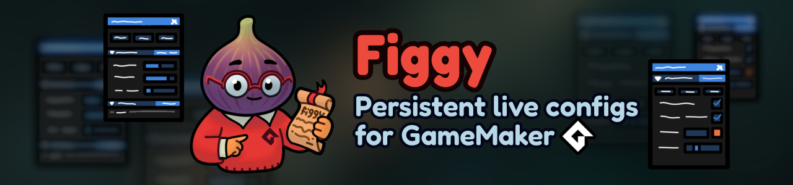

# What is Figgy?

## Overview

Figgy is a pure GML [Free and Open Source](https://en.wikipedia.org/wiki/Free_and_open-source_software) lightweight GameMaker library - a centralized and persistent live configuration system for seamless game tuning and balancing.

## Why Use It?

Figgy eliminates the constant cycle of recompiling and searching through assets to adjust gameplay values. After defining your stats and parameters in Setup, Figgy automatically builds a :Debug Overlay: interface that lets you live-edit values while the game is running, access them in code, and save changes directly within your project's datafiles.

Whether you're a solo developer or part of a team, working on a big project or a weekend-long game jam, Figgy streamlines balancing and tuning, keeping iteration fast and effortless. It also gives your non-programmer team members full design control without touching a single line of code.

## Features

⚙️ **Automatic Live :Interface:**. Figgy creates [debug views](https://manual.gamemaker.io/lts/en/GameMaker_Language/GML_Reference/Debugging/The_Debug_Overlay.htm#:~:text=using%C2%A0dbg_view.-,Views,-This%20menu%20lists) for your configs automatically, freeing you from dreaded UI coding of any kind and allowing for live editing.

🗂️ **Flexible Data Structure**. Organize your configs using a robust struct-based tree-like JSON layout with :Scope Widgets:, including :Windows:, :Sections:, and :Groups:.

🎛️ **Wide Data Type Coverage**. Built on GameMaker's cross-platform :Debug Overlay:, Figgy provides several :Value Widgets: for all commonly used data types: :Ints:, :Floats:, :Reals:, :Bools:, :Strings:, :Colors: and :Anys:.

💾 **Persistent Project Storage**. Keep your configs inside your GitHub repo with Figgy's automatic (and optionally [obfuscated](/pages/home/persistence/#obfuscation)) datafiles [saving & loading](/pages/home/persistence) support that tracks variables differing from default values (or the whole config, if specified).

🧠 **Centralized Configuration**. Keep all gameplay values in one place and read them from the config struct - no more scattered Create-event variables or magic numbers.

👨‍🎨 **Code-Free Design**. Allow your designers to tweak and balance the game live without ever having to touch code. Everything is accessible through the :Interface:.

## Games Using Figgy

* [DirtWorld](https://jbw-games.itch.io/dirtworld) by [Joe Baxter-Webb (Indie Game Clinic)](https://indiegameclinic.com/).
* tobu by [Thomas Threlfo](https://bsky.app/profile/tthrelfo.bsky.social).
* And more to come :)
